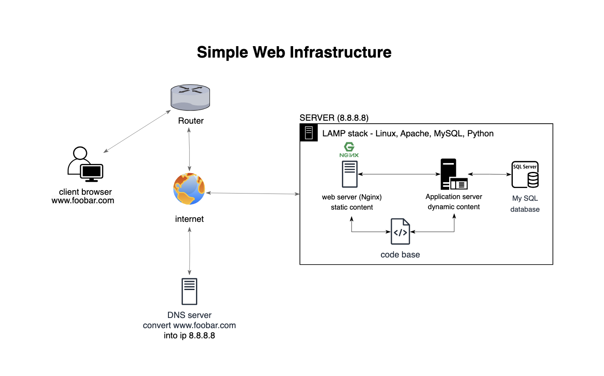

# 0.Simple web stack

## Descrption

### Infrastructure Design

Components:

- 1 Server: Physical or virtual machine hosting the entire web infrastructure.
- 1 Web Server (Nginx): Handles incoming HTTP requests, serves static content, and forwards dynamic requests to the application server.
- 1 Application Server: Processes dynamic content, interacts with the application files, and generates responses.
- 1 Application Files (Your Code Base): Contains the code, logic, templates, and resources necessary for the web application.
- 1 Database (MySQL): Stores and retrieves data for the web application.
- 1 Domain Name (foobar.com) with a www record: Allows users to access the website via www.foobar.com; the www record points to the server IP (8.8.8.8).

### What is a server:

A server is a physical or virtual machine that receives and provides resources, services, or data to other computers or machines, called clients.

### The role of a domain name:

A domain name (foobar.com) is a human-readable address that maps to a server’s IP. It provides users with an easy way to navigate the web.

### DNS record type for www.foobar.com :

The DN↳S record at www.foobar.com consists of a CNAME (Canonical Name) record that specifies the IP address of the server (8.8.8.8).

### Role of web server (Nginx):

Nginx processes incoming HTTP requests, serves static content, and acts as a reverse proxy, sending dynamic requests to the application server.

### Role of the application server:

Application servers handle dynamic information, make web application business logic, and interact with application files and databases.

### Use database (MySQL):

MySQL is a relational database management system for storing, retrieving, and managing data for web applications.

### Server connection to the user's computer:

The server communicates with the user's computer through the HTTP protocol. The web server (Nginx) and the application server generate and serve HTTP responses.

## issues with this infrastructure:

### Single point of failure (SPOF):

The entire infrastructure is based on a single server. If this server fails, the entire network becomes inaccessible. To address this, consider redundancy, load balancing, or distributed architecture.

### Downtime during maintenance:

Using new code or performing maintenance may require a restart of the web server, causing downtime. Reduce this by using rolling updates, canary releases, or redundant servers.

### ScalabilityChallenges: .

Scaling is limited to a single server. Think about how you will handle high traffic
