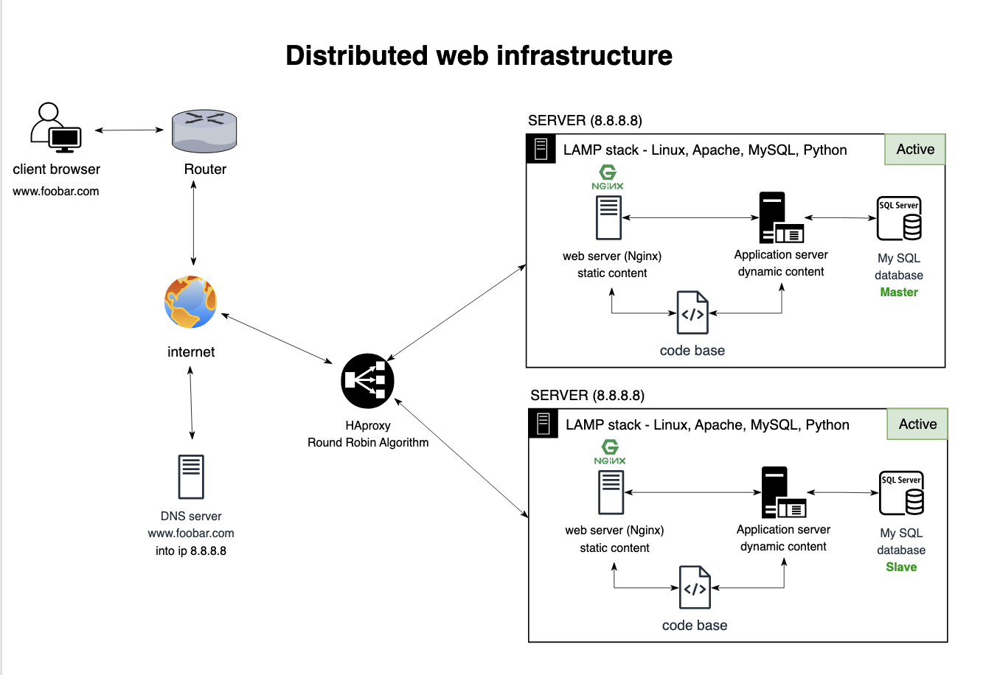

# 1.Distributed web infrastructure

## Descrption

### Infrastructure Design

Components:

- 2 Servers: Physical or virtual machine hosting the entire web infrastructure.
- 1 Web Server (Nginx): Handles incoming HTTP requests, serves static content, and forwards dynamic requests to the application server.
- 1 Application Server: Processes dynamic content, interacts with the application files, and generates responses.
- 1 Application Files (Your Code Base): Contains the code, logic, templates, and resources necessary for the web application.
- 1 load-balancer (HAproxy): for distributing incoming requests or network traffic among multiple servers.
- 1 Database (MySQL): Stores and retrieves data for the web application.
- 1 Domain Name (foobar.com) with a www record: Allows users to access the website via www.foobar.com; the www record points to the server IP (8.8.8.8).

### What is a server:

- A server is a physical or virtual machine that receives and provides resources, services, or data to other computers or machines, called clients.

### The role of a domain name:

- A domain name (foobar.com) is a human-readable address that maps to a server’s IP. It provides users with an easy way to navigate the web.

### DNS record type for www.foobar.com :

- The DN↳S record at www.foobar.com consists of a CNAME (Canonical Name) record that specifies the IP address of the server (8.8.8.8).

### Role of web server (Nginx):

- Nginx processes incoming HTTP requests, serves static content, and acts as a reverse proxy, sending dynamic requests to the application server.

### Role of the application server:

- Application servers handle dynamic information, make web application business logic, and interact with application files and databases.

### Use database (MySQL):

- MySQL is a relational database management system for storing, retrieving, and managing data for web applications.

###  load-balancer (HAproxy):

- HAProxy is included to distribute incoming traffic among the two servers. This improves resource utilization, enhances availability, and provides load balancing.

### Distribution Algorithm:

- HAProxy is configured with the Round Robin distribution algorithm. This algorithm cycles through the list of servers, directing each new request to the next server in the list.

### Active-Active vs. Active-Passive:

- HAProxy is configured for an Active-Active setup. Both servers actively handle incoming requests simultaneously, providing better resource utilization and scalability.

### How Database Primary-Replica Cluster Works:

- The Primary-Replica (Master-Slave) cluster involves a Primary node (Master) that handles write operations and multiple Replica nodes (Slaves) that replicate data from the Primary. Read operations can be distributed among the Replicas.

### Difference Between Primary and Replica in Regard to the Application:

- The Primary node is responsible for handling write operations, ensuring data consistency. Replicas can handle read operations, distributing the load and improving read performance.

### Server connection to the user's computer:

- The server communicates with the user's computer through the HTTP protocol. The web server (Nginx) and the application server generate and serve HTTP responses.

## issues with this infrastructure:

### Single point of failure (SPOF):

- The load balancer (HAProxy) is a potential single point of failure. If it fails, incoming traffic won't be distributed, impacting the availability of the web application.

### Security Issues (No Firewall, No HTTPS):

- Lack of a firewall poses a security risk as it doesn't provide a barrier against unauthorized access. Additionally, the absence of HTTPS exposes the communication between clients and servers to potential eavesdropping.

### No Monitoring:

- The infrastructure lacks a monitoring system, making it challenging to identify and address performance issues, potential failures, or security breaches proactively. Monitoring is crucial for maintaining system health and security.
