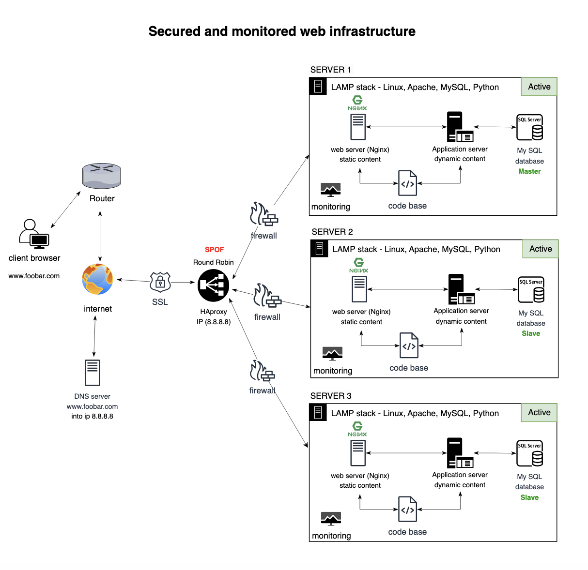

# 2. Secured and monitored web infrastructure

## Descrption

### Infrastructure Design

Components:

- 3 Servers: Physical or virtual machine hosting the entire web infrastructure.
- 1 Web Server (Nginx): Handles incoming HTTP requests, serves static content, and forwards dynamic requests to the application server.
- 1 Application Server: Processes dynamic content, interacts with the application files, and generates responses.
- 1 Application Files (Your Code Base): Contains the code, logic, templates, and resources necessary for the web application.
- 1 load-balancer (HAproxy): for distributing incoming requests or network traffic among multiple servers.
- 1 Database (MySQL): Stores and retrieves data for the web application.
- 1 Domain Name (foobar.com) with a www record: Allows users to access the website via www.foobar.com; the www record points to the server IP (8.8.8.8).
- 3 firewalls
- 1 SSL certificate to serve www.foobar.com over HTTPS
- 3 monitoring clients (data collector for Sumologic or other monitoring services)

### What is a server:

- A server is a physical or virtual machine that receives and provides resources, services, or data to other computers or machines, called clients.

### The role of a domain name:

- A domain name (foobar.com) is a human-readable address that maps to a server’s IP. It provides users with an easy way to navigate the web.

### DNS record type for www.foobar.com :

- The DN↳S record at www.foobar.com consists of a CNAME (Canonical Name) record that specifies the IP address of the server (8.8.8.8).

### Role of web server (Nginx):

- Nginx processes incoming HTTP requests, serves static content, and acts as a reverse proxy, sending dynamic requests to the application server.

### Role of the application server:

- Application servers handle dynamic information, make web application business logic, and interact with application files and databases.

### Use database (MySQL):

- MySQL is a relational database management system for storing, retrieving, and managing data for web applications.

###  load-balancer (HAproxy):

- HAProxy is included to distribute incoming traffic among the two servers. This improves resource utilization, enhances availability, and provides load balancing.

### Distribution Algorithm:

- HAProxy is configured with the Round Robin distribution algorithm. This algorithm cycles through the list of servers, directing each new request to the next server in the list.

### Active-Active vs. Active-Passive:

- HAProxy is configured for an Active-Active setup. Both servers actively handle incoming requests simultaneously, providing better resource utilization and scalability.

### How Database Primary-Replica Cluster Works:

- The Primary-Replica (Master-Slave) cluster involves a Primary node (Master) that handles write operations and multiple Replica nodes (Slaves) that replicate data from the Primary. Read operations can be distributed among the Replicas.

### Difference Between Primary and Replica in Regard to the Application:

- The Primary node is responsible for handling write operations, ensuring data consistency. Replicas can handle read operations, distributing the load and improving read performance.

### Server connection to the user's computer:

- The server communicates with the user's computer through the HTTP protocol. The web server (Nginx) and the application server generate and serve HTTP responses.

### Firewalls

- Firewalls are added for security purposes. They act as a barrier between the internal network and external threats, controlling incoming and outgoing network traffic based on predetermined security rules.

### SSL Certificate for HTTPS:

- HTTPS encrypts the communication between the user's browser and the web server, ensuring the confidentiality and integrity of data in transit. This is essential for protecting sensitive information and maintaining user trust.

### Monitoring Clients (Data Collectors):

- Monitoring is crucial for maintaining the health, performance, and security of the infrastructure. Monitoring clients, acting as data collectors, gather information on various metrics, errors, and performance indicators, allowing proactive identification and resolution of issues.

### Why Traffic Served Over HTTPS:

- Traffic is served over HTTPS to encrypt data in transit, preventing eavesdropping and tampering. It ensures the confidentiality of user data and protects against man-in-the-middle attacks.

### What Monitoring Is Used For:

- Monitoring is used to observe the health, performance, and security of the infrastructure. It helps identify issues, trends, and anomalies, allowing for proactive management, troubleshooting, and optimization.

### How Monitoring Tool Collects Data:

- Monitoring tools collect data by deploying agents or clients on servers. These agents continuously gather information about system metrics, logs, and events, sending this data to a centralized monitoring server or service.

### Monitoring Web Server QPS:

- To monitor Web Server Queries Per Second (QPS), configure the monitoring tool to collect and analyze metrics related to the web server's request rate. This may include metrics from Nginx or other web server logs.

## issues with this infrastructure:

### Single point of failure (SPOF):

- The load balancer (HAProxy) is a potential single point of failure. If it fails, incoming traffic won't be distributed, impacting the availability of the web application.

### Terminating SSL at the Load Balancer Level:

- While terminating SSL at the load balancer level can offload processing from backend servers, it poses a security risk. Data between the load balancer and backend servers is transmitted in plaintext, potentially exposing sensitive information.

### Single MySQL Server Accepting Writes:

- Having only one MySQL server capable of accepting writes introduces a single point of failure. If this server fails, it can lead to data unavailability and service disruption. Consider implementing a MySQL cluster or replication for fault tolerance.

### Servers with Same Components (Database, Web Server, Application Server):

- Homogeneous servers may lead to a lack of diversity in the infrastructure. If a common flaw or vulnerability affects one server, it might affect all others. Consider diversifying the stack or introducing redundancy to mitigate potential widespread issues.

